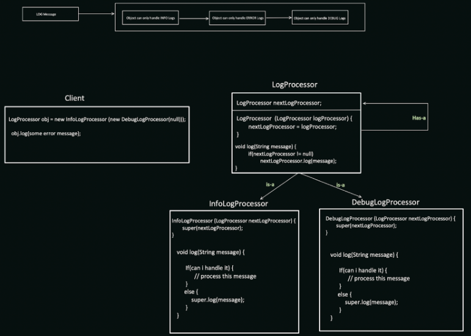

# Chain of Responsibility Design Pattern

The Chain of Responsibility design pattern creates a chain of objects that can handle a request. The request passes along the chain until an object handles it or the end of the chain is reached. This pattern is useful in scenarios where:

* Multiple objects can potentially handle a request: Facilitates processing a request by different objects based on their capabilities.
* Order of handling matters: Enforces a specific order in which objects can attempt to handle the request.
* Decoupling request handling: Separates request senders from specific handlers, promoting flexibility.

## Benefits

* Flexibility: Enables adding or removing handlers dynamically without affecting other parts of the system.
* Decoupling: Separates request senders from specific handlers, improving maintainability.
* Loose Coupling: Promotes loose coupling between objects by relying on interfaces for communication.

## Implementation

The Chain of Responsibility design pattern involves the following key components:

1. Handler Interface: Defines a common interface for handling requests. Methods typically include setNextHandler(Handler) and handle(Request).
2. Concrete Handlers: Implement the Handler interface and provide specific logic for handling requests. Optionally, they can set the next handler in the chain.
3. Client: Creates the chain of handlers and initiates the request handling process.




EXAMPLE:  ATM Machine, Vendor Machine, Logger**, Loan Approval, etc.

## Example

```Java
interface Handler {
void setNextHandler(Handler next);
void handle(Request request);
}

class CEOHandler implements Handler {
private Handler next;

@Override
public void setNextHandler(Handler next) {
this.next = next;
}

@Override
public void handle(Request request) {
if (request.getAmount() > 10000) {
System.out.println("CEO approves request for $" + request.getAmount());
} else if (next != null) {
next.handle(request);
} else {
System.out.println("Request for $" + request.getAmount() + " not approved");
}
}
}

class ManagerHandler implements Handler {
private Handler next;

@Override
public void setNextHandler(Handler next) {
this.next = next;
}

@Override
public void handle(Request request) {
if (request.getAmount() > 5000) {
System.out.println("Manager approves request for $" + request.getAmount());
} else if (next != null) {
next.handle(request);
} else {
System.out.println("Request for $" + request.getAmount() + " not approved");
}
}
}

class Request {
private int amount;

public Request(int amount) {
this.amount = amount;
}

public int getAmount() {
return amount;
}
}

public class Main {
public static void main(String[] args) {
Handler ceoHandler = new CEOHandler();
Handler managerHandler = new ManagerHandler();

    ceoHandler.setNextHandler(managerHandler);

    Request request1 = new Request(4000);
    ceoHandler.handle(request1); // Output: Manager approves request for $4000

    Request request2 = new Request(12000);
    ceoHandler.handle(request2); // Output: CEO approves request for $12000
}
}
```


```Python
from abc import ABC, abstractmethod

class Handler(ABC):
    @abstractmethod
    def set_next(self, handler):
        pass
    
    @abstractmethod
    def handle(self, request):
        pass 


class CEOHandler(Handler):
    def __init__(self):
        self.next = None
    
    def set_next(self, handler):
        self.next = handler
    
    def handle(self, request):
        if request.amount > 10000:
            print(f"CEO approves request for ${request.amount}")
        elif self.next:
            self.next.handle(request)
        else:
            print(f"Request for ${request.amount} not approved")

class ManagerHandler(Handler):
    def __init__(self):
        self.next = None
    
    def set_next(self, handler):
        self.next = handler
    
    def handle(self, request):
        if request.amount > 5000:
            print(f"Manager approves request for ${request.amount}")
        elif self.next:
            self.next.handle(request)
        else:
            print(f"Request for ${request.amount} not approved")
```