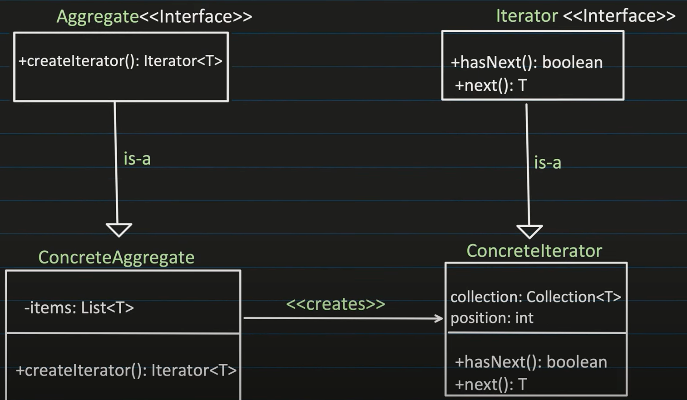
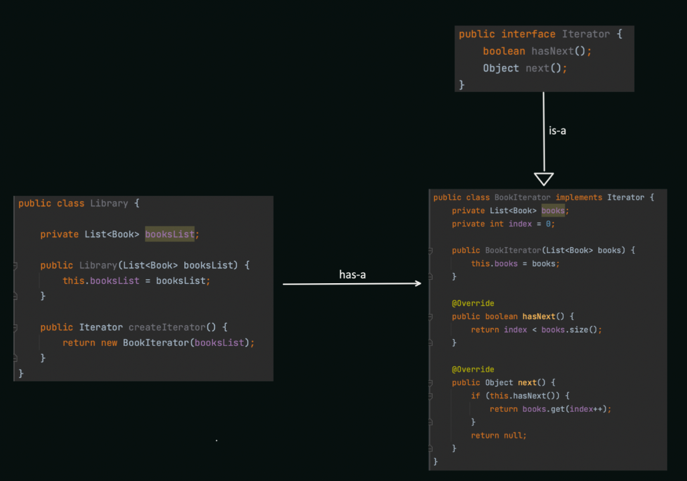

# Iterator Design Pattern


The Iterator design pattern provides a way to access the elements of an object collection (aggregate) in a sequential, controlled manner without exposing the underlying structure of the collection. It allows you to create a separate object (iterator) responsible for traversing the collection and returning elements one by one.

## When to Use:

* When you need to hide the internal representation of a collection and provide a way to access its elements without relying on its specific implementation.
* When you want to design collections that can be traversed by different algorithms without modifying the collection itself.
* When you need to create interchangeable iterators for different types of collections.

## Benefits:

* Decoupling: Separates the collection from the code that iterates over its elements.
* Encapsulation: Hides the internal structure of the collection.
* Flexibility: Enables different algorithms to iterate over the collection without modifying it.
* Reusability: Iterators can be reused for different collections.

## Implementation:

1. Iterator Interface: Defines the interface for iterating over a collection, including methods like hasNext() to check for next element and next() to retrieve the next element.
2. Concrete Iterators: Implement the Iterator interface and provide specific ways to iterate over different types of collections.
3. Aggregate (Collection): Provides access to an iterator object that allows traversing the collection's elements.




## Example:

```Java
public interface Iterator<T> {
  boolean hasNext();
  T next();
}

public class ArrayListIterator<T> implements Iterator<T> {
  private final List<T> list;
  private int currentIdx;

  public ArrayListIterator(List<T> list) {
    this.list = list;
    currentIdx = 0;
  }

  @Override
  public boolean hasNext() {
    return currentIdx < list.size();
  }

  @Override
  public T next() {
    if (hasNext()) {
      return list.get(currentIdx++);
    }
    throw new NoSuchElementException();
  }
}

public class ArrayList<T> {
  private List<T> elements;

  public ArrayList() {
    elements = new ArrayList<>();
  }

  // ... methods to add, remove, and access elements

  public Iterator<T> iterator() {
    return new ArrayListIterator<>(elements);
  }
}

public class Main {
  public static void main(String[] args) {
    ArrayList<String> names = new ArrayList<>();
    names.add("Alice");
    names.add("Bob");
    names.add("Charlie");

    Iterator<String> iterator = names.iterator();
    while (iterator.hasNext()) {
      System.out.println(iterator.next());
    }
  }
}
```

```python
from abc import ABC, abstractmethod

class Iterator(ABC):
  @abstractmethod
  def __next__(self):
    pass

  def __iter__(self):
    return self

class ArrayListIterator(Iterator):
  def __init__(self, data_list):
    self.data_list = data_list
    self.current_index = 0

  def __next__(self):
    if self.current_index < len(self.data_list):
      item = self.data_list[self.current_index]
      self.current_index += 1
      return item
    else:
      raise StopIteration

class ArrayList:
  def __init__(self):
    self.data_list = []

  # ... methods to add, remove, and access elements

  def __iter__(self):
    return ArrayListIterator(self.data_list)

# Usage
names = ArrayList()
names.append("Alice")
names.append("Bob")
names.append("Charlie")

for name in names:
  print(name)
```

## Key Points:

* The Iterator pattern provides a controlled and standardized way to traverse over elements in a collection.
* It decouples the collection from the code that iterates over it, promoting flexibility and maintainability.
* Concrete iterators can be implemented for different types of collections with varying access logic.