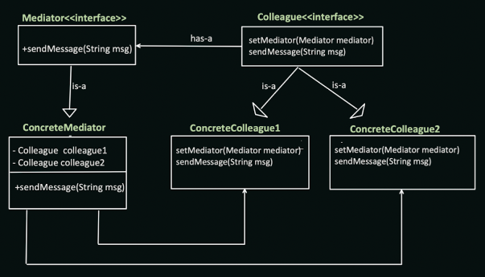
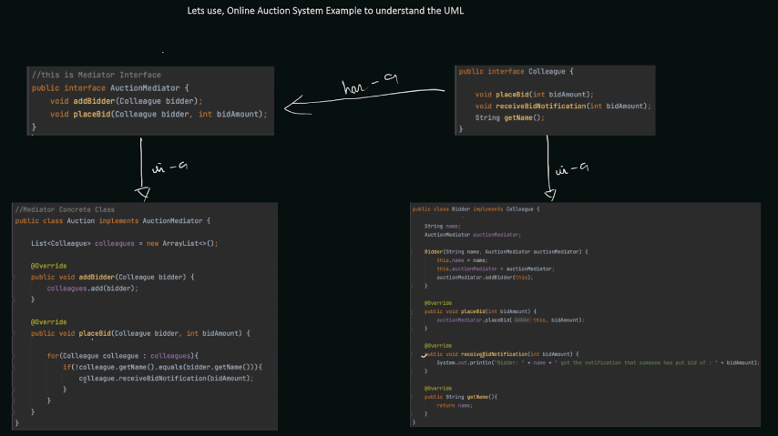

# Mediator Design Pattern

The Mediator design pattern promotes loose coupling by introducing a central mediator object that facilitates communication between a set of objects. Instead of objects communicating directly with each other, they delegate communication to the mediator, which acts as a central hub for interactions.

## When to Use:

* When you have a complex network of objects with many dependencies.
* When you want to centralize control and reduce dependencies between objects.
* When you need to simplify communication logic and increase maintainability.

## Benefits:

* Decoupling: Reduces dependencies between objects by centralizing communication through the mediator.
* Improved Maintainability: Modifying communication logic is easier as it's centralized in the mediator.
* Flexibility: Adding or removing objects becomes simpler as they don't need to be aware of changes in other objects.
* Reduced Complexity: Simplifies communication and interaction management.

## Implementation:

1. Mediator Interface: Defines the interface for the central mediator object. This might include methods to register objects, send messages, and facilitate interactions.
2. Concrete Mediator: Implements the Mediator interface and provides specific logic for coordinating communication between registered objects.
3. Concrete Objects (Colleagues): Implement functionalities and interact with the mediator to send and receive messages.




Examples: Airline management System, Chat application


## Example:

```java
public interface Mediator {
  void register(Colleague colleague);
  void sendMessage(String message, Colleague sender);
}

public abstract class Colleague {
  protected Mediator mediator;

  public Colleague(Mediator mediator) {
    this.mediator = mediator;
  }

  public void send(String message) {
    mediator.sendMessage(message, this);
  }

  public abstract void receive(String message);
}

public class ChatMediator implements Mediator {
  private List<Colleague> colleagues = new ArrayList<>();

  @Override
  public void register(Colleague colleague) {
    colleagues.add(colleague);
  }

  @Override
  public void sendMessage(String message, Colleague sender) {
    for (Colleague colleague : colleagues) {
      if (colleague != sender) {
        colleague.receive(message);
      }
    }
  }
}

public class User extends Colleague {
  public User(Mediator mediator, String name) {
    super(mediator);
    System.out.println("User " + name + " joined the chat");
  }

  @Override
  public void receive(String message) {
    System.out.println("User received message: " + message);
  }
}

public class Main {
  public static void main(String[] args) {
    Mediator chatMediator = new ChatMediator();

    User user1 = new User(chatMediator, "Alice");
    User user2 = new User(chatMediator, "Bob");

    user1.send("Hello everyone!");
    user2.send("Hi Alice!");
  }
}
```

```python
from abc import ABC, abstractmethod

class Mediator(ABC):
  @abstractmethod
  def register(self, colleague):
    pass

  @abstractmethod
  def send_message(self, message, sender):
    pass

class Colleague(ABC):
  def __init__(self, mediator):
    self.mediator = mediator

  def send(self, message):
    self.mediator.send_message(message, self)

  @abstractmethod
  def receive(self, message):
    pass

class ChatMediator(Mediator):
  def __init__(self):
    self.colleagues = []

  def register(self, colleague):
    self.colleagues.append(colleague)

  def send_message(self, message, sender):
    for colleague in self.colleagues:
      if colleague != sender:
        colleague.receive(message)

class User(Colleague):
  def __init__(self, mediator, name):
    super().__init__(mediator)
    print(f"User {name} joined the chat")

  def receive(self, message):
    print(f"User received message: {message}")

# Usage
chat_mediator = ChatMediator()

user1 = User(chat_mediator, "Alice")
user2 = User(chat_mediator, "Bob")

user1.send("Hello everyone!")
user2.send("Hi Alice!")
```

## Key Points:

* The Mediator design pattern introduces a central mediator object for communication, reducing dependencies between objects.
* Communication logic is centralized in the mediator, making it easier to modify and maintain.
* The pattern promotes loose coupling and improves the flexibility

