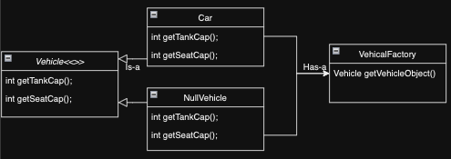

# Null Object Design Pattern

The Null Object design pattern provides a surrogate for null references. It introduces a null object class that acts as a default object whenever a null reference is expected. This allows you to avoid null checks and conditional branching in your code, improving readability and maintainability.

## When to Use:

* When you frequently perform null checks on objects.
* When you want to avoid complex conditional logic in your code based on the presence or absence of an object.
* When you need to treat null references like regular objects and provide default behavior.

## Benefits:

* Reduced Null Checks: Eliminates the need for explicit null checks in code.
* Improved Readability: Code becomes cleaner and easier to understand without conditional branches for null handling.
* Flexibility: The null object can be designed to implement specific default behaviors.
* Consistency: Allows treating null references and regular objects in a similar way.

## Implementation:

1. Object Interface: Defines the methods commonly used by concrete objects in the system.
2. Null Object Class: Implements the Object Interface and provides default (often no-op) implementations for all methods.
3. Real Object Class(es): Implement the Object Interface with concrete functionality.
4. Object Factory (Optional): Provides a way to create instances of Real or Null objects based on specific conditions.



## Example:

```Java
public interface Customer {
  String getName();
  boolean isLoyal();
  String getDiscount();
}

public class NullCustomer implements Customer {
  @Override
  public String getName() {
    return "Unknown";
  }

  @Override
  public boolean isLoyal() {
    return false;
  }

  @Override
  public String getDiscount() {
    return "No discount";
  }
}

public class RealCustomer implements Customer {
  private String name;
  private boolean loyal;

  public RealCustomer(String name, boolean loyal) {
    this.name = name;
    this.loyal = loyal;
  }

  @Override
  public String getName() {
    return name;
  }

  @Override
  public boolean isLoyal() {
    return loyal;
  }

  @Override
  public String getDiscount() {
    return loyal ? "10% discount" : "No discount";
  }
}

public class Main {
  public static void main(String[] args) {
    Customer customer1 = new RealCustomer("Alice", true);
    System.out.println(customer1.getName() + " discount: " + customer1.getDiscount());

    Customer customer2 = new NullCustomer();  // Use null object instead of null
    System.out.println(customer2.getName() + " discount: " + customer2.getDiscount());
  }
}
```

```python
from abc import ABC, abstractmethod

class Customer(ABC):
  @abstractmethod
  def get_name(self):
    pass

  @abstractmethod
  def is_loyal(self):
    pass

  @abstractmethod
  def get_discount(self):
    pass

class NullCustomer(Customer):
  def get_name(self):
    return "Unknown"

  def is_loyal(self):
    return False

  def get_discount(self):
    return "No discount"

class RealCustomer(Customer):
  def __init__(self, name, loyal):
    self.name = name
    self.loyal = loyal

  def get_name(self):
    return self.name

  def is_loyal(self):
    return self.loyal

  def get_discount(self):
    return "10% discount" if self.loyal else "No discount"

# Usage
customer1 = RealCustomer("Alice", True)
print(f"{customer1.get_name()} discount: {customer1.get_discount()}")

customer2 = NullCustomer()  # Use null object instead of None
print(f"{customer2.get_name()} discount: {customer2.get_discount()}")
```

## Key Points:

* The Null Object pattern avoids null checks by providing a default object for null references.
* It improves code readability and maintainability by eliminating conditional logic for handling nulls.
* The null object can be designed to implement specific default behavior as needed.


