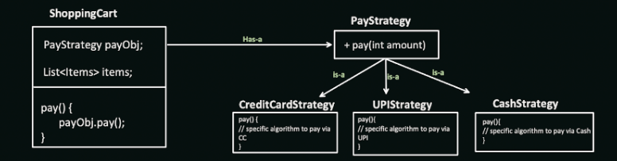

# Strategy Design Pattern

The Strategy design pattern allows you to define a family of algorithms, encapsulate each one, and make them interchangeable. This pattern promotes dynamic selection of algorithms at runtime based on specific conditions. It's useful in scenarios where:

* Multiple algorithms perform similar tasks with different details: Encapsulating algorithms as separate strategies allows for easy switching between them.
* Algorithmic behavior needs to be independent of its context: Decouples algorithms from the client code, promoting flexibility.
* Open/Closed Principle compliance: Enables adding new algorithms without modifying the client code.

## Benefits

* Flexibility: Allows for dynamic selection of algorithms at runtime.
* Decoupling: Separates algorithms from the client code, improving maintainability.
* Reusability: Enables the reuse of algorithms across different contexts.
* Open/Closed Principle: Allows adding new algorithms without modifying existing code.



## Implementation

The Strategy design pattern involves the following key components:

1. Strategy Interface: Defines the common interface for all algorithms in the family.
2. Concrete Strategies: Implement the Strategy interface and provide specific implementations of the algorithms.
3. Context: Uses a Strategy object and can set or change the strategy at runtime.


## Example

```Java
interface SortStrategy {
void sort(List<Integer> data);
}

class BubbleSortStrategy implements SortStrategy {
@Override
public void sort(List<Integer> data) 
 {
// Implement bubble sort logic
System.out.println("Sorting using Bubble Sort");
}
}

class SelectionSortStrategy implements SortStrategy {
@Override
public void sort(List<Integer> data) {
// Implement selection sort logic
System.out.println("Sorting using Selection Sort");
}
}

class DataSorter {
private SortStrategy strategy;

public void setStrategy(SortStrategy strategy) {
this.strategy = strategy;
}

public void sortData(List<Integer> 
 data) {
strategy.sort(data);
}
}

public class Main {
public static void main(String[] args) {
DataSorter sorter = new DataSorter();
sorter.setStrategy(new BubbleSortStrategy());
sorter.sortData(Arrays.asList(5, 2, 8, 1, 4));

    sorter.setStrategy(new SelectionSortStrategy());
    sorter.sortData(Arrays.asList(5, 2, 8, 1, 4));
}
}
```

```Python
from abc import ABC, abstractmethod

class SortStrategy:
@abstractmethod
def sort(self, data):
pass

class BubbleSortStrategy(SortStrategy):
def sort(self, data):
# Implement bubble sort logic
print("Sorting using Bubble Sort")
# Example using built-in functions for brevity
data.sort()

class SelectionSortStrategy(SortStrategy):
def sort(self, data):
# Implement selection sort logic
print("Sorting using Selection Sort")
# Example using built-in functions for brevity
data.sort()

class DataSorter:
def __init__(self, strategy):
self.strategy = strategy

def set_strategy(self, strategy):
self.strategy = strategy

def sort_data(self, data):
self.strategy.sort(data) 


# Usage
sorter = DataSorter(BubbleSortStrategy())
sorter.sort_data([5, 2, 8, 1, 4])

sorter.set_strategy(SelectionSortStrategy())
sorter.sort_data([5, 2, 8, 1, 4])
```

## Key points:

* The Strategy pattern allows for dynamic selection of algorithms based on context.
* It promotes code maintainability by separating algorithms from the client code.
* New algorithms can be added easily without modifying existing code, adhering to the Open/Closed Principle.