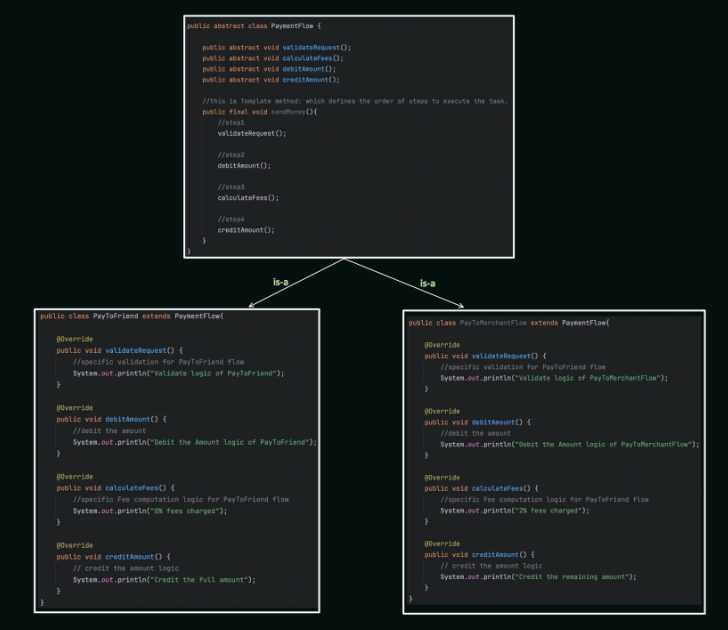

Template Method Design Pattern

The Template Method design pattern defines the skeleton of an algorithm in an operation, deferring some steps to subclasses. It allows subclasses to override specific steps without changing the overall structure of the algorithm. This pattern promotes code reuse, flexibility, and consistency in implementing algorithms with variations.

## When to Use:

* When you have a core algorithm with variations in specific steps.
* When you want to enforce a common structure for an algorithm with customizable behavior.
* When you need to promote code reuse for common algorithm steps.

## Benefits:

* Code Reuse: Reuses core algorithm logic while allowing customization by subclasses.
* Flexibility: Subclasses can override specific steps to tailor the algorithm to their needs.
* Consistency: Ensures a consistent overall structure for the algorithm across subclasses.
* Maintainability: Makes it easier to modify the core algorithm and its variations.

## Implementation:

1. Abstract Class: Defines the template method, which outlines the overall structure of the algorithm. This method often includes calls to primitive operations (which might be abstract or concrete) and/or hook methods (which subclasses can override).
2. Concrete Subclasses: Implement the algorithm by overriding specific hook methods or providing concrete implementations for primitive operations.



## Example:

```Java
public abstract class OrderProcessor {

public final void processOrder(Order order) {
validateOrder(order);
calculateTotal(order);
processPayment(order);
fulfillOrder(order);
}

protected abstract void validateOrder(Order order);

protected abstract void calculateTotal(Order order);

protected abstract void processPayment(Order order);

protected void fulfillOrder(Order order) {
System.out.println("Fulfilling order: " + order);
}
}

public class DomesticOrderProcessor extends OrderProcessor {

@Override
protected void validateOrder(Order order) {
// Domestic order validation logic
System.out.println("Validating domestic order...");
}

@Override
protected void calculateTotal(Order order) {
// Domestic order total calculation logic (including shipping)
System.out.println("Calculating total for domestic order...");
}

@Override
protected void processPayment(Order order) {
// Domestic order payment processing logic
System.out.println("Processing payment for domestic order...");
}
}

public class InternationalOrderProcessor extends OrderProcessor {

@Override
protected void validateOrder(Order order) {
// International order validation logic (including customs)
System.out.println("Validating international order...");
}

@Override
protected void calculateTotal(Order order) {
// International order total calculation logic (including customs and international shipping)
System.out.println("Calculating total for international order...");
}

@Override
// May have different payment processing logic for international orders
protected void processPayment(Order order) {
System.out.println("Processing payment for international order...");
}
}

public class Main {
public static void main(String[] args) {
OrderProcessor domesticProcessor = new DomesticOrderProcessor();
domesticProcessor.processOrder(new Order("Domestic", 100.0));

    OrderProcessor internationalProcessor = new InternationalOrderProcessor();
    internationalProcessor.processOrder(new Order("International", 200.0));
}
}
```


```Python
from abc import ABC, abstractmethod

class OrderProcessor(ABC):

    def process_order(self, order):
        self.validate_order(order)
        self.calculate_total(order)
        self.process_payment(order)
        self.fulfill_order(order)
    
    @abstractmethod
    def validate_order(self, order):
        pass
    
    @abstractmethod
    def calculate_total(self, order):
        pass
    
    @abstractmethod
    def process_payment(self, order):
        pass
    
    def fulfill_order(self, order):
        print(f"Fulfilling order: {order}")

class DomesticOrderProcessor(OrderProcessor):

    def validate_order(self, order):
    # Domestic order validation logic
        print("Validating domestic order...")
    
    def calculate_total(self, order):
    # Domestic order total calculation logic (including shipping)
        print("Calculating total for domestic order...")
    
    def process_payment(self, order):
    # Domestic order payment processing logic
        print("Processing payment for domestic order...")
```