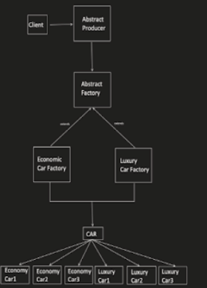

# Abstract Factory Design Pattern
The Abstract Factory design pattern provides an interface for creating families of related or dependent objects without specifying their concrete classes. This pattern goes a step further than the Factory pattern by creating multiple related objects at once. It's useful in scenarios where:   

* Creating families of objects is needed: Helps ensure consistency within a set of related objects.
* Platform or framework independence is desired: Enables switching between different implementations of object families (e.g., database access layers).

## Benefits

* Consistent Object Creation: Ensures objects within a family are created and configured consistently.
* Platform Independence: Allows for easy switching between different object families for different platforms.
* Loose Coupling: Decouples client code from the specific implementation details of objects.

## Implementation

The Abstract Factory design pattern involves the following key components:

1. Abstract Factory Interface: Defines the methods for creating different types of products within the family.
2. Concrete Factory: Implements the Abstract Factory interface and creates specific product types based on the chosen family.
3. Product Interface (Optional): Defines the common interface for products within the family.
4. Concrete Products: Implement the Product interface and represent the specific objects within the family.
5. Client: Utilizes the Abstract Factory to create families of related objects without knowing the specific product implementations.



## Example 
```java
interface Shape {
void draw();
}

class Circle implements Shape {
@Override
public void draw() {
System.out.println("Drawing Circle");
}
}

class Square implements Shape {
@Override
public void draw() {
System.out.println("Drawing Square");  

  }
}

interface Color {
void fill();
}

class Red implements Color {
@Override
public void fill() {
System.out.println("Filling with Red");

  }
}

class Green implements Color {
@Override
public void fill() {
System.out.println("Filling with Green");
}
}

interface AbstractFactory {
Shape getShape(String shapeType);
Color getColor(String colorType);
}

class ShapeFactory implements AbstractFactory {
@Override
public Shape getShape(String shapeType) {
if (shapeType.equalsIgnoreCase("circle"))
 {
return new Circle();
} else if (shapeType.equalsIgnoreCase("square")) {
return new Square();
} else {
throw new IllegalArgumentException("Invalid shape type: " + shapeType);
}
}

@Override
public Color getColor(String colorType) {
throw new UnsupportedOperationException("ShapeFactory does not create colors");
}
}

class ColorFactory implements AbstractFactory {
@Override
public Shape getShape(String shapeType) {
throw new UnsupportedOperationException("ColorFactory does not create shapes");
}

@Override
public Color getColor(String colorType) {
if (colorType.equalsIgnoreCase("red")) {
return new Red();
} else if (colorType.equalsIgnoreCase("green")) {
return new Green();

    } else {
                         throw new IllegalArgumentException("Invalid color type: " + colorType);
                       }
}
}

public class Main {
public static void main(String[] args) {
AbstractFactory shapeFactory = new ShapeFactory();
Shape shape1 = shapeFactory.getShape("circle");
shape1.draw();


    AbstractFactory colorFactory = new ColorFactory();
                  Color color1 = colorFactory.getColor("red");
                  color1.fill();
}
}
```

```python
from abc import ABC, abstractmethod

class Shape(ABC):
  @abstractmethod
  def draw(self):
    pass

class Circle(Shape):
  def draw(self):
    print("Drawing Circle")

class Square(Shape):
  def draw(self):
    print("Drawing Square")

class Color(ABC):
  @abstractmethod
  def fill(self):
    pass

class Red(Color):
  def fill(self):
    print("Filling with Red")

class Green(Color):
  def fill(self):
    print("Filling with Green")

class AbstractFactory:
  def __init__(self):
    self.shape_map = {
      "circle": Circle,
      "square": Square,
    }
    self.color_map = {
      "red": Red,
      "green": Green,
    }

  def get_shape(self, shape_type):
    if shape_type not in self.shape_map:
      raise ValueError(f"Invalid shape type: {shape_type}")
    return self.shape_map[shape_type]()

  def get_color(self, color_type):
    if color_type not in self.color_map:
      raise ValueError(f"Invalid color type: {color_type}")
    return self.color_map[color_type]()

# Usage
shape_factory = AbstractFactory()
color_factory = AbstractFactory()

shape1 = shape_factory.get_shape("circle")
shape1.draw()

color1 = color_factory.get_color("red")
color1.fill()
```