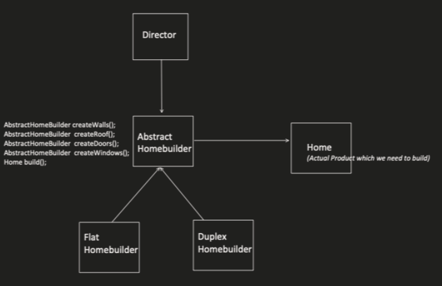

# Builder Design Pattern

The Builder design pattern provides a flexible approach to constructing complex objects by separating the construction process from the object itself. It allows for step-by-step object creation with optional parameters and facilitates immutable objects. This pattern is useful in scenarios where:

* Complex object construction is needed: Breaks down complex object creation into smaller, more manageable steps.
* Customization is required: Enables the creation of objects with varying configurations based on user needs.
* Immutable objects are desired: Promotes the creation of immutable objects by building them in a controlled manner.
* Benefits
* Improved Readability: Separates object construction logic from the object itself.
* Flexible Construction: Allows for building objects step-by-step with optional parameters.
* Immutable Objects: Promotes the creation of immutable objects by ensuring complete construction before exposure.

## Implementation

The Builder design pattern involves the following key components:

1. Builder Interface: Defines the methods for constructing different parts of the object.
2. Concrete Builder: Implements the Builder interface and builds the specific object step-by-step.
3. Director (Optional): Optionally controls the construction process by specifying the building steps.
4. Product: The final object being constructed.



## Example 

Let's consider a pizza ordering system where we want to create different types of pizzas with varying toppings and sizes. We can use the Builder pattern to create a flexible and customizable way to build pizzas.

```java
public interface PizzaBuilder {
PizzaBuilder setSize(String size);
PizzaBuilder addTopping(String topping);
Pizza build();
}

public class HawaiianPizzaBuilder implements PizzaBuilder {
private Pizza pizza = new Pizza();

@Override
public PizzaBuilder setSize(String size) {
pizza.setSize(size);
return this;
}

@Override
public PizzaBuilder addTopping(String topping) {
if (topping.equalsIgnoreCase("pineapple")) {
pizza.addTopping(topping);
} else {
System.out.println("Invalid topping for Hawaiian pizza: " + topping);
}
return this;
}

@Override
public Pizza build() {
return pizza;
}
}

public class Pizza {
private String size;
private List<String> toppings;

private Pizza() {
this.toppings = new ArrayList<>();
}

// Getters and Setters for size and toppings
}

public class Main {
public static void main(String[] args) {
PizzaBuilder builder = new HawaiianPizzaBuilder();
Pizza hawaiianPizza = builder.setSize("medium").addTopping("pineapple").build();

    System.out.println("Hawaiian Pizza: " + hawaiianPizza.getSize() + ", Toppings: " + hawaiianPizza.getToppings());
}
}
```

```python
class PizzaBuilder:
def __init__(self):
self.size = None
self.toppings = []

def set_size(self, size):
self.size = size
return self

def add_topping(self, topping):
if topping == "pineapple":
self.toppings.append(topping)
else:
print(f"Invalid topping for Hawaiian pizza: {topping}")
return self

def build(self):
return Pizza(self.size, self.toppings)

class Pizza:
def __init__(self, size, toppings):
self.size = size
self.toppings = toppings

# Usage
pizza_builder = PizzaBuilder()
hawaiian_pizza = pizza_builder.set_size("medium").add_topping("pineapple").build()

print(f"Hawaiian Pizza: {hawaiian_pizza.size}, Toppings: {hawaiian_pizza.toppings}")
```

## Key points:

* The Builder pattern improves code readability by separating object construction from the object itself.
* It allows for flexible and customizable object creation by providing methods for setting different properties.
* The Builder pattern can be used to create immutable objects by ensuring all properties are set before the final object is returned.


