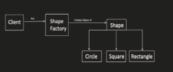

# Factory Design Pattern

The Factory design pattern provides an interface for creating objects without exposing the creation logic to the client. It allows for flexible object creation based on different criteria. This pattern is useful in scenarios where:

* Object creation is complex: Simplifies object creation by centralizing the logic in a factory class.
* Multiple object types exist: Enables the creation of different object types based on input parameters.
* Customization is needed: Allows for dynamic creation of objects with varying configurations.

## Benefits

* Loose Coupling: Decouples the client code from the specific object implementation.
* Flexible Object Creation: Enables the creation of different object types based on client needs.
* Encapsulation: Centralizes object creation logic in the factory class.

## Implementation

The Factory design pattern involves the following key components:

1. Factory Interface (Optional): Defines the method for creating objects (often named createProduct).
2. Concrete Factory: Implements the factory interface and creates specific product types.
3. Product Interface: Defines the common interface for the objects created by the factory (optional).
4. Concrete Products: Implement the product interface and represent the different types of objects that can be created.
5. Client: Utilizes the factory to create objects without knowing the specific product implementations.



```java
interface Shape {
void draw();
}

class Circle implements Shape {
@Override
public void draw() {
System.out.println("Drawing Circle");
}
}

class Square implements Shape {
@Override
public void draw() {
System.out.println("Drawing Square");   

  }
}

interface ShapeFactory {
Shape createShape(String shapeType);
}

class ShapeFactoryImpl implements ShapeFactory {

@Override
public Shape createShape(String shapeType) {
if (shapeType.equalsIgnoreCase("circle")) {
return new Circle();
} else if (shapeType.equalsIgnoreCase("square"))   
 {
return new Square();
} else {
throw new IllegalArgumentException("Invalid shape   
 type: " + shapeType);
}
}
}

public class Main {
public static void main(String[] args) {
ShapeFactory factory = new ShapeFactoryImpl();

    Shape shape1 = factory.createShape("circle");
    shape1.draw();

    Shape shape2 = factory.createShape("square");
    shape2.draw();
}
}
```

```python
from abc import ABC, abstractmethod

class Shape(ABC):
@abstractmethod
def draw(self):
pass

class Circle(Shape):
def draw(self):
print("Drawing Circle")

class Square(Shape):
def draw(self):
print("Drawing Square")

class   
 ShapeFactory:
def __init__(self):
self.shapes = {
"circle": Circle,
"square": Square,
}

def create_shape(self, shape_type):
if shape_type not in self.shapes:
raise ValueError(f"Invalid shape type: {shape_type}")
return self.shapes[shape_type]()

# Usage
shape_factory = ShapeFactory()

shape1 = shape_factory.create_shape("circle")
shape1.draw()

shape2 = shape_factory.create_shape("square")
shape2.draw()
```

Key Points:

* The Factory pattern promotes loose coupling by decoupling clients from specific object creation logic.
* It allows for flexible object creation based on runtime conditions or user input.
* Consider using abstract factories for creating families of related objects.

## When to Use the Factory Pattern

