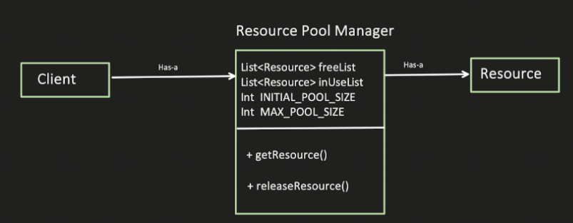

# Object Pool Design Pattern

The Object Pool design pattern provides a mechanism for managing a pool of reusable objects. It aims to improve performance by reducing the overhead of object creation and destruction, especially for expensive or resource-intensive objects. This pattern is beneficial in scenarios where:

This Object pool pattern is used with Singleton pattern and requires thread safety while acquiring or releasing the resource.

* Object creation is expensive: When creating instances of objects involves complex initialization logic or significant resource allocation.
* Objects are frequently created and destroyed: When applications frequently create and discard objects of the same type.
* A limited number of objects are needed: When the application requires a certain number of objects to function, and exceeding that limit is not desirable.
* Examples of such scenarios include database connections, threads, sockets, and graphic objects.

## Benefits

* Improved Performance: Reduces the overhead associated with creating and destroying objects.
* Resource Management: Ensures efficient utilization of resources by reusing objects instead of constantly creating new ones.
* Controlled Object Lifetime: Provides a mechanism to control the creation and destruction of objects.

## Implementation

The Object Pool design pattern involves the following key components:

1. Object Pool: A container class that manages the pool of reusable objects.
2. Pooled Object: The type of object being managed by the pool.
3. Factory (Optional): Optionally used to create new objects when the pool is depleted.
4. Client: Utilizes the Object Pool to acquire and release objects from the pool.



## Example

Let's consider an example of a Connection Pool that manages a pool of database connections. The Connection Pool class maintains a queue of available connections and provides methods to acquire and release connections.

```java
public class ConnectionPool {

private static final int MAX_CONNECTIONS = 10;
private final Queue<DatabaseConnection> availableConnections;

public ConnectionPool() {
availableConnections = new LinkedList<>();
for (int i = 0; i < MAX_CONNECTIONS; i++) {
availableConnections.offer(new DatabaseConnection());
}
}

public synchronized DatabaseConnection getConnection() throws InterruptedException {
while (availableConnections.isEmpty()) {
wait();
}
return availableConnections.poll();
}

public synchronized void releaseConnection(DatabaseConnection connection) {
availableConnections.offer(connection);
notify();
}
}

public class DatabaseConnection {
// ... connection logic
}

public class Main {
public static void main(String[] args) throws InterruptedException {
ConnectionPool pool = new ConnectionPool();

    DatabaseConnection connection1 = pool.getConnection();
    // Use connection1

    pool.releaseConnection(connection1);

    DatabaseConnection connection2 = pool.getConnection();
    // Use connection2

    pool.releaseConnection(connection2);
}
}
```

```python
from queue import Queue

class ConnectionPool:
MAX_CONNECTIONS = 10
available_connections = Queue(maxsize=MAX_CONNECTIONS)

def __init__(self):
for _ in range(self.MAX_CONNECTIONS):
self.available_connections.put(DatabaseConnection())

def get_connection(self):
connection = self.available_connections.get()
return connection

def release_connection(self, connection):
self.available_connections.put(connection)

class DatabaseConnection:
# ... connection logic

# Usage
pool = ConnectionPool()

connection1 = pool.get_connection()
# Use connection1

pool.release_connection(connection1)

connection2 = pool.get_connection()
# Use connection2

pool.release_connection(connection2)
```

## Key Points:

* The Object Pool pattern reduces the overhead of creating and destroying objects by reusing existing ones.
* It is crucial to ensure proper resource management for pooled objects, especially for objects that hold resources like database connections.
* Consider implementing a mechanism for returning objects that are no longer valid within the pool.


