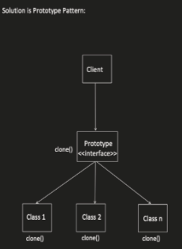

# _Prototype design pattern_
The Prototype design pattern is a creational pattern that allows for efficient object creation by cloning existing objects. This approach is particularly useful in scenarios where:

- Object creation is expensive: If creating new objects involves complex initialization logic or resource allocation, copying an existing object can be significantly faster.
- Numerous potential object types exist: When dealing with a variety of potential object types, the prototype pattern enables you to create new instances only when needed at runtime.


## Benefits
- Improved Performance: Reduces the overhead associated with creating complex objects from scratch.
- Flexibility: Enables the creation of new objects based on existing ones, promoting code reuse.
- Reduced Subclasses: Avoids creating unnecessary subclasses for minor variations of the object.

## Implementation
The Prototype design pattern involves the following key components:

- Prototype Interface (Optional): This interface defines the cloning operation for concrete prototypes.
- Concrete Prototype: Implements the Prototype interface (if defined) and provides the specific object to be cloned. It must define a cloning method that returns a copy of itself.
- Client: Utilizes the prototype to create new objects. It retrieves the prototype from a registry or directly instantiates it.



Key Points:

* The prototype pattern avoids the overhead of creating objects from scratch, especially for complex objects.
* The clone() method performs a deep copy of the object, ensuring that changes to the cloned object don't affect the original.
* This example demonstrates how to clone objects with mutable fields like languages.

## Example
```java
import java.util.ArrayList;
import java.util.List;

interface Prototype {
    Prototype clone();
}

class Employee implements Prototype {
    private int id;
    private String name;
    private String department;
    private List<String> languages;

    public Employee(int id, String name, String department) {
        this.id = id;
        this.name = name;
        this.department = department;
        this.languages = new ArrayList<>();
    }

    public void addLanguage(String language) {
        languages.add(language);
    }

    public Prototype clone() {
        Employee clonedEmployee = new Employee(id, name, department);
        clonedEmployee.languages.addAll(languages);
        return clonedEmployee;
    }

    @Override
    public String toString() {
        return "Employee{" +
                "id=" + id +
                ", name='" + name + '\'' +
                ", department='" + department + '\'' +
                ", languages=" + languages +
                '}';
    }
}

public class PrototypePatternDemo {
    public static void main(String[] args) {
        Employee employee1 = new Employee(1, "John Doe", "IT");
        employee1.addLanguage("Java");
        employee1.addLanguage("Python");

        Prototype clonedEmployee = employee1.clone();
        ((Employee) clonedEmployee).addLanguage("C++");

        System.out.println("Original Employee: " + employee1);
        System.out.println("Cloned Employee: " + clonedEmployee);
    }
}
```
##Explanation:

* Prototype interface: Defines the clone() method.
* Employee class: Implements the Prototype interface.
* - Contains employee information (id, name, department, languages).
* - The clone() method creates a new Employee object and deep copies the languages list.
* PrototypePatternDemo: Demonstrates the usage of the prototype pattern.
* - Creates an Employee object and adds languages.
* - Clones the employee using the clone() method.
* - Adds a new language to the cloned employee.
* - Prints both the original and cloned employees.

```python
from abc import ABC, abstractmethod

class Shape(ABC):
  @abstractmethod
  def clone(self):
    pass

class Circle(Shape):
  def __init__(self, radius):
    self.radius = radius

  def clone(self):
    return Circle(self.radius)

class Square(Shape):
  def __init__(self, side):
    self.side = side

  def clone(self):
    return Square(self.side)

circle_prototype = Circle(5)
square_prototype = Square(3)
new_circle = circle_prototype.clone()
new_square = square_prototype.clone()
print(f"New Circle: {new_circle.radius}")
print(f"New Square: {new_square.side}")
```
This example demonstrates a simple implementation of the Prototype pattern. The Shape class acts as the optional interface, while Circle and Square are the concrete prototypes. The client can create new instances of these shapes by cloning them, avoiding the need for additional object creation logic.

The README.md file can further include information on the trade-offs of using the Prototype pattern, such as potential deep copying overhead for complex objects and the need for careful management of the prototype registry (if used).
