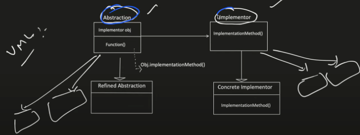
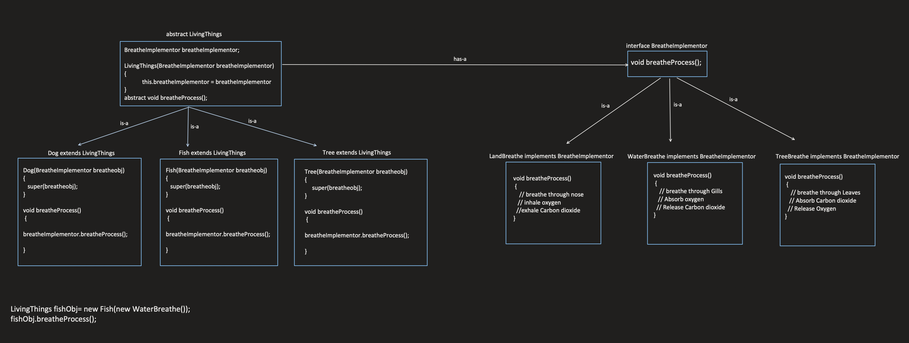

# Bridge Design Pattern

The Bridge design pattern decouples an abstraction from its implementation so that they can vary independently. This allows for changing either the abstraction or the implementation without affecting the other.

## When to Use:

* When you want to separate the abstraction of what something does from the specific implementation details of how it does it.
* When you need to support different implementations of the same abstraction.
* When you want to be able to change the implementation of an object without affecting the clients using it.

## Benefits:

* Decoupling: Separates the abstraction from its implementation, promoting flexibility and maintainability.
* Extensibility: Allows for adding new implementations of the abstraction without modifying existing code.
* Reusability: Enables reusing the same abstraction with different implementations.
* Open/Closed Principle (OCP): Supports extending the functionality of both the abstraction and implementation without modifying existing code.

## Implementation:

1. Abstraction Interface: Defines the interface that specifies the operations the abstraction provides.
2. Concrete Abstraction: Implements the Abstraction Interface and refines it to a specific context.
3. Implementor Interface: Defines the interface that specifies the operations that the implementation must provide.
4. Concrete Implementor: Implements the Implementor Interface and provides a specific implementation of the functionality.



UML of bridge and Strategy DP looks similar but intent is different Strategy intent is to change the abstract class object at run time while intent of bridge is to make both abstract class and child grow independently





##  Example:

```Java
public interface DrawingAPI {
  void drawCircle(double x, double y, double radius);
}

public class RedCircle implements Shape {
  private DrawingAPI drawingAPI;

  public RedCircle(DrawingAPI drawingAPI) {
    this.drawingAPI = drawingAPI;
  }

  @Override
  public void draw() {
    drawingAPI.drawCircle(1, 1, 0.5);
  }
}

public class GreenCircle implements Shape {
  private DrawingAPI drawingAPI;

  public GreenCircle(DrawingAPI drawingAPI) {
    this.drawingAPI = drawingAPI;
  }

  @Override
  public void draw() {
    drawingAPI.drawCircle(5, 5, 0.7);
  }
}

public class RasterDrawingAPI implements DrawingAPI {
  @Override
  public void drawCircle(double x, double y, double radius) {
    System.out.println("Drawing circle using raster API at (" + x + "," + y + ") with radius " + radius);
  }
}

public class VectorDrawingAPI implements DrawingAPI {
  @Override
  public void drawCircle(double x, double y, double radius) {
    System.out.println("Drawing circle using vector API at (" + x + "," + y + ") with radius " + radius);
  }
}

public class Main {
  public static void main(String[] args) {
    DrawingAPI rasterAPI = new RasterDrawingAPI();
    DrawingAPI vectorAPI = new VectorDrawingAPI();

    Shape redCircle = new RedCircle(rasterAPI);
    redCircle.draw(); // Output: Drawing circle using raster API at (1.0,1.0) with radius 0.5

    Shape greenCircle = new GreenCircle(vectorAPI);
    greenCircle.draw(); // Output: Drawing circle using vector API at (5.0,5.0) with radius 0.7
  }
}
```

```Python
from abc import ABC, abstractmethod

class DrawingAPI(ABC):
  @abstractmethod
  def draw_circle(self, x, y, radius):
    pass

class Shape(ABC):
  @abstractmethod
  def draw(self):
    pass

class RedCircle(Shape):
  def __init__(self, drawing_api):
    self.drawing_api = drawing_api

  def draw(self):
    self.drawing_api.draw_circle(1, 1, 0.5)

class GreenCircle(Shape):
  def __init__(self, drawing_api):
    self.drawing_api = drawing_api

  def draw(self):
    self.drawing_api.draw_circle(5, 5, 0.7)

class RasterDrawingAPI(DrawingAPI):
  def draw_circle(self, x, y, radius):
    print(f"Drawing circle using raster API at ({x},{y}) with radius {radius}")

class VectorDrawingAPI(DrawingAPI):
  def draw_circle(self, x, y, radius):
    print(f"Drawing circle using vector API at ({x},{y}) with radius {radius}")

# Usage
raster_api = RasterDrawingAPI()
vector_api = VectorDrawingAPI()

red_circle = RedCircle(raster_api)
red_circle.draw()  # Output: Drawing circle using raster API at (1,1) with radius 0.5

green_circle = GreenCircle(vector_api)
green_circle.draw()  # Output: Drawing circle using vector API at (5,5) with radius 0.7

```