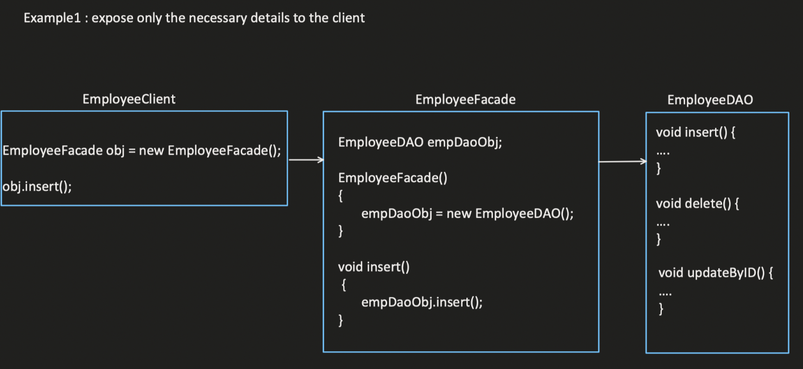

# Facade Design Pattern

The Facade design pattern simplifies the interface of a complex subsystem by providing a single, unified entry point. It hides the complexities of the subsystem by encapsulating its components and operations behind a simpler facade interface.

## When to Use:

* When you have a complex subsystem with a large number of interfaces or classes.
* When you want to simplify the interaction with the subsystem for clients.
* When you want to decouple clients from the internal implementation details of the subsystem.
  
Facades are often used to encapsulate subsystems
## Benefits:

* Simplified Interface: Provides a simpler and more manageable interface for clients.
* Decoupling: Reduces coupling between clients and the complex subsystem.
* Increased Readability: Improves code readability by hiding the complexities of the subsystem.
* Control Over Dependencies: Allows for controlling access and dependencies within the subsystem.

## Implementation:

1. Facade Interface: Defines the simplified interface that clients will use to interact with the subsystem.
2. Facade Class: Implements the Facade Interface and interacts with the components of the subsystem on behalf of the client.





````
Facade vs Proxy-
Proxy can take care of only one object and the type of proxy will be same as that object type
Facade vs Adapter-
Adapter is used to bring compatibility between the client and original interface while Facade it to hide the complexity from the client
````

## Example:

```Java
public interface Shape {
  void draw();
}

public class Circle implements Shape {
  @Override
  public void draw() {
    System.out.println("Drawing a circle");
  }
}

public class Square implements Shape {
  @Override
  public void draw() {
    System.out.println("Drawing a square");
  }
}

public class ShapeMaker {
  private Shape circle;
  private Shape square;

  public ShapeMaker() {
    circle = new Circle();
    square = new Square();
  }

  public void drawCircle() {
    circle.draw();
  }

  public void drawSquare() {
    square.draw();
  }
}

public class Main {
  public static void main(String[] args) {
    ShapeMaker shapeMaker = new ShapeMaker();
    shapeMaker.drawCircle();  // Output: Drawing a circle
    shapeMaker.drawSquare();  // Output: Drawing a square
  }
}
```

```python
from abc import ABC, abstractmethod

class Shape(ABC):
  @abstractmethod
  def draw(self):
    pass

class Circle(Shape):
  def draw(self):
    print("Drawing a circle")

class Square(Shape):
  def draw(self):
    print("Drawing a square")

class ShapeMaker:
  def __init__(self):
    self.circle = Circle()
    self.square = Square()

  def draw_circle(self):
    self.circle.draw()

  def draw_square(self):
    self.square.draw()

# Usage
shape_maker = ShapeMaker()
shape_maker.draw_circle()  # Output: Drawing a circle
shape_maker.draw_square()  // Output: Drawing a square
```
## Key Points:

* The Facade design pattern provides a clean and simplified interface to a complex subsystem.
* Clients interact with the facade instead of the individual components of the subsystem.
* The facade can manage the dependencies and interactions between the subsystem components.