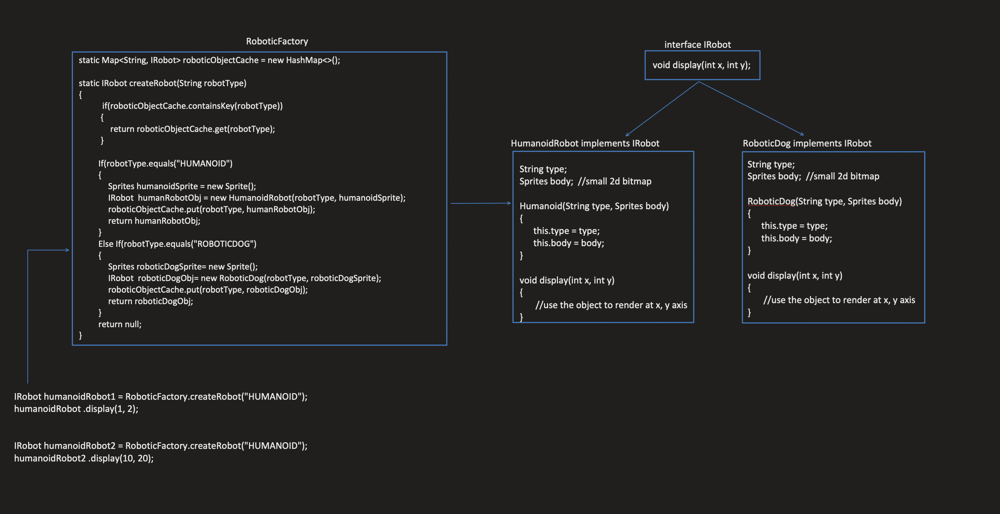

# Flyweight Design Pattern

The Flyweight design pattern minimizes memory usage by sharing common state between a large number of similar objects. It achieves this by creating and managing a pool of reusable lightweight objects (Flyweights) that can be used in different contexts without duplicating their intrinsic state.

## When to Use:

* When your application creates a large number of similar objects that consume a lot of memory.
* When the objects differ only in a small amount of extrinsic state (state specific to each object).
* When performance is critical due to the cost of object creation or memory limitations.

## Benefits:

* Reduced Memory Consumption: Shares common state among objects, minimizing memory usage.
* Improved Performance: Reduces the overhead of object creation and garbage collection.
* Efficiency: Enables efficient handling of large collections of similar objects.


## Implementation:

1. Flyweight Interface: Defines the interface for the flyweight objects.
2. Concrete Flyweight: Implements the Flyweight Interface and stores the intrinsic state (shared among objects).
3. Flyweight Factory: Manages the creation and reuse of flyweight objects. Ensures that only one instance of each flyweight object exists.
4. Client: Creates and uses the flyweight objects through a factory or pool mechanism. Clients provide the extrinsic state (specific to each object) when using the flyweight object.

## Applying the Flyweight Pattern:
* Intrinsic Data: Data that remains the same for all objects of a particular type and is defined once. In the example, the Type and Body of the Robot objects are intrinsic data.
* Extrinsic Data: Data that varies from one object to another, often based on client input. In the example, the x and y coordinates of the Robot objects are extrinsic data.
* Flyweight Object: An object that contains only intrinsic data and can be shared among multiple instances. By removing extrinsic data from the Robot objects, they can become flyweight objects.
* Passing Extrinsic Data: The extrinsic data can be passed as parameters to the flyweight object when it's used, allowing for different configurations.
* Caching: Caching can be implemented to reuse flyweight objects, further reducing memory consumption.

1. Identify Intrinsic Data: Determine which data attributes of the Robot objects are shared among all instances. In this case, Type and Body seem to be intrinsic.
2. Create Flyweight Class: Define a RobotFlyweight class that contains only the intrinsic data (Type and Body).
3. Use Flyweight Factory: Implement a factory to create and manage flyweight objects, ensuring that only one instance exists for each unique combination of intrinsic data.
4. Pass Extrinsic Data: When creating a object, pass the extrinsic data (e.g., x and y coordinates) as parameters to the flyweight object.



## Example:

```Java
public interface Shape {
  void draw(String color);
}

public class Circle implements Shape {
  private String name;

  public Circle(String name) {
    this.name = name;
  }

  @Override
  public void draw(String color) {
    System.out.println("Drawing " + name + " circle with color: " + color);
  }
}

public class ShapeFactory {
  private static Map<String, Shape> shapes = new HashMap<>();

  public Shape getShape(String shapeType) {
    Shape shape = shapes.get(shapeType);
    if (shape == null) {
      shape = new Circle(shapeType);
      shapes.put(shapeType, shape);
    }
    return shape;
  }
}

public class Main {
  public static void main(String[] args) {
    ShapeFactory shapeFactory = new ShapeFactory();

    Shape redCircle = shapeFactory.getShape("Red Circle");
    redCircle.draw("red"); // Output: Drawing Red Circle circle with color: red

    Shape blueCircle = shapeFactory.getShape("Blue Circle");
    blueCircle.draw("blue"); // Output: Drawing Blue Circle circle with color: blue  (Reuses Circle object)
  }
}
```


```Python
public interface Shape {
  void draw(String color);
}

public class Circle implements Shape {
  private String name;

  public Circle(String name) {
    this.name = name;
  }

  @Override
  public void draw(String color) {
    System.out.println("Drawing " + name + " circle with color: " + color);
  }
}

public class ShapeFactory {
  private static Map<String, Shape> shapes = new HashMap<>();

  public Shape getShape(String shapeType) {
    Shape shape = shapes.get(shapeType);
    if (shape == null) {
      shape = new Circle(shapeType);
      shapes.put(shapeType, shape);
    }
    return shape;
  }
}

public class Main {
  public static void main(String[] args) {
    ShapeFactory shapeFactory = new ShapeFactory();

    Shape redCircle = shapeFactory.getShape("Red Circle");
    redCircle.draw("red"); // Output: Drawing Red Circle circle with color: red

    Shape blueCircle = shapeFactory.getShape("Blue Circle");
    blueCircle.draw("blue"); // Output: Drawing Blue Circle circle with color: blue  (Reuses Circle object)
  }
}
```

## Key Points:

* The Flyweight pattern reduces memory usage by sharing common state among objects.
* Intrinsic state is stored in the Flyweight object, while extrinsic state is provided by clients at runtime.
* Flyweight objects are often managed through a factory or pool to ensure efficient creation and reuse.

