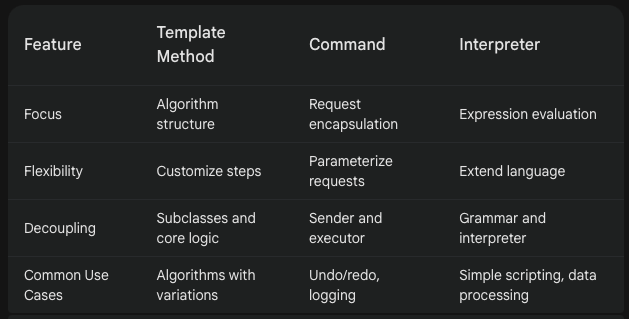

# Interpreter Design Pattern
The Interpreter design pattern defines a way to evaluate expressions or language grammar by representing them as a tree of objects. Each object in the tree corresponds to a symbol or rule in the language and has methods to interpret its meaning in the context of the expression.

Defines a grammer for interpreting and evaluating an expression.

## When to Use:

* When you need to create a system that interprets a simple language or set of expressions.
* When you want to decouple the grammar of the language from the code that evaluates it.
* When you need to extend the language by adding new expressions without modifying existing code.

## Benefits:

* Flexibility: Allows defining new expressions or extending the language by adding new interpreter objects.
* Decoupling: Separates the grammar of the language from the code that evaluates it, improving maintainability.
* Reusability: Interpreter objects can be reused for different expressions sharing common substructures.

## Implementation:

1. Expression Interface: Defines the common interface for interpreting expressions.
2. Terminal Expressions: Represent basic elements of the language (e.g., variables, constants).
3. Non-Terminal Expressions: Represent composite expressions and handle interpretation of sub-expressions (e.g., operators, function calls).

Example: 

## Example:

```Java
interface Expression {
int interpret(Context context);
}

class NumberExpression implements Expression {
private int number;

public NumberExpression(int number) {
this.number = number;
}

@Override
public int interpret(Context context) {
return number;
}
}

class AdditionExpression implements Expression {
private Expression leftExpr;
private Expression rightExpr;

public AdditionExpression(Expression leftExpr, Expression rightExpr) {
this.leftExpr = leftExpr;
this.rightExpr = rightExpr;
}

@Override
public int interpret(Context context) {
return leftExpr.interpret(context) + rightExpr.interpret(context);
}
}

class SubtractionExpression implements Expression {
private Expression leftExpr;
private Expression rightExpr;

public SubtractionExpression(Expression leftExpr, Expression rightExpr) {
this.leftExpr = leftExpr;
this.rightExpr = rightExpr;
}

@Override
public int interpret(Context context) {
return leftExpr.interpret(context) - rightExpr.interpret(context);
}
}

class Context {
// ... variables used by expressions
}

public class Main {
public static void main(String[] args) {
Expression expression = new AdditionExpression(
new NumberExpression(5),
new SubtractionExpression(new NumberExpression(10), new NumberExpression(2))
);

    Context context = new Context(); // ... set context variables if needed

    int result = expression.interpret(context);
    System.out.println("Result: " + result); // Output: Result: 3
}
}
```

```Python
from abc import ABC, abstractmethod

class Expression(ABC):
    @abstractmethod
    def interpret(self, context):
        pass

class NumberExpression(Expression):
    def __init__(self, number):
        self.number = number

    def interpret(self, context):
        return self.number 


class AdditionExpression(Expression):
    def __init__(self, leftExpr, rightExpr):
        self.leftExpr = leftExpr
        self.rightExpr = rightExpr
    
    def interpret(self, context):
        return self.leftExpr.interpret(context) + self.rightExpr.interpret(context)

class SubtractionExpression(Expression):
    def __init__(self, leftExpr, rightExpr):
        self.leftExpr = leftExpr
        self.rightExpr = rightExpr
    
    def interpret(self, context):
        return self.leftExpr.interpret(context) - self.rightExpr.interpret(context)

class Context:
# ... variables used by expressions

# Usage
expression = AdditionExpression(
NumberExpression(5),
SubtractionExpression(NumberExpression(10), NumberExpression(2))
)

context = Context()  # ... set context variables if needed

result = expression.interpret(context)
print(f"Result: {result}")  # Output: Result: 3
```

## Template Method vs. Command vs. Interpreter:

These design patterns share some similarities but serve different purposes:

* Template Method: Provides a skeleton of an algorithm that can be customized by subclasses. It focuses on defining the overall structure and common steps of an algorithm, allowing variations in specific steps.
* Command: Encapsulates a request as an object, allowing decoupling the request sender from the request executor. It emphasizes encapsulating requests for parameterization and execution on demand, often used for undo/redo or logging.
* Interpreter: Defines a way to evaluate expressions or language grammar by representing them as a tree of objects. It focuses on parsing and interpreting a specific language or set of expressions, often used for simple scripting languages or data processing.

## Key Differences:


