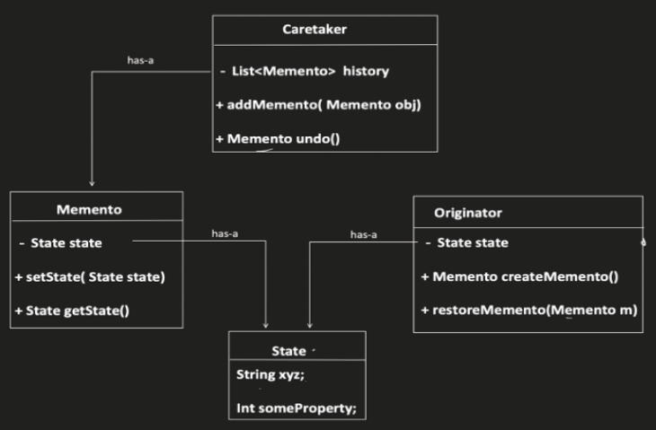

# Memento Design Pattern

The Memento design pattern allows you to capture and store the internal state of an object (Originator) without exposing its internal structure. This saved state (Memento) can be used to restore the object to a previous state later.

## When to Use:

* When you need to undo/redo operations on an object.
* When you want to create a checkpoint mechanism in your application to restore past states.
* When decoupling the object's state from the code responsible for managing the history.

## Benefits:

* Undo/Redo Functionality: Enables implementing undo/redo actions by restoring the object's state from Mementos(snapshot/history).
* Encapsulation: Hides the internal structure of the Originator from outside code.
* State Management: Provides a centralized location (Caretaker) to manage Memento objects and facilitate state restoration.

## Implementation:

1. Originator: Represents the object whose state needs to be saved and restored.
* * Provides methods to create a Memento object (createMemento) capturing its current state.
* * Offers a method to restore its state (setMemento) from a previously created Memento.
2. Memento: An immutable object that encapsulates the saved state of the Originator.
* * Should not expose methods to modify the saved state.
3. Caretaker (Optional): (Not always required) Holds a reference to one or more Mementos.
* * Stores Mementos for the Originator and can provide them on request for state restoration.




## Example:

```Java
public class TextEditor {
  private String text;

  public TextEditor(String text) {
    this.text = text;
  }

  public String getText() {
    return text;
  }

  public void setText(String text) {
    this.text = text;
  }

  public Memento createMemento() {
    return new Memento(text);
  }

  public void setMemento(Memento memento) {
    this.text = memento.getText();
  }
}

public class Memento {
  private final String text;

  public Memento(String text) {
    this.text = text;
  }

  public String getText() {
    return text;
  }
}

public class Main {
  public static void main(String[] args) {
    TextEditor editor = new TextEditor("Initial text");
    System.out.println("Current text: " + editor.getText());

    Memento memento = editor.createMemento(); // Save initial state

    editor.setText("Modified text");
    System.out.println("Modified text: " + editor.getText());

    editor.setMemento(memento); // Restore to initial state
    System.out.println("Restored text: " + editor.getText());
  }
}
```

```python
from copy import deepcopy

class TextEditor:
  def __init__(self, text):
    self.text = text

  def get_text(self):
    return self.text

  def set_text(self, text):
    self.text = text

  def create_memento(self):
    return deepcopy(self.text)  # Deep copy for immutability

  def set_memento(self, memento):
    self.text = memento

# Usage
editor = TextEditor("Initial text")
print("Current text:", editor.get_text())

memento = editor.create_memento()  # Save initial state

editor.set_text("Modified text")
print("Modified text:", editor.get_text())

editor.set_memento(memento)  # Restore to initial state
print("Restored text:", editor.get_text())
```

## Key Points:

* The Memento pattern promotes loose coupling by encapsulating state management in Mementos.
* It enables undo/redo functionality by restoring the Originator's state from previous Mementos.
* The Caretaker (optional) provides a central location to manage Memento objects for the Originator.
