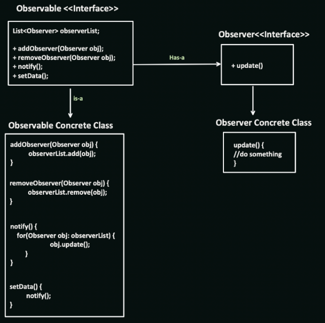

# Observer Design Pattern

The Observer design pattern defines a one-to-many dependency between objects. When one object changes state (subject), all its dependent objects (observers) are notified and updated automatically. This pattern is useful in scenarios where:

* Objects need to be notified of changes in another object: When multiple objects need to react to changes in a single source (e.g., updating UI based on data changes).
* Loose Coupling: Decoupling the subject from specific observers promotes flexibility and maintainability.
* Dynamic Subscriptions: Allows observers to subscribe and unsubscribe dynamically as needed.

## Benefits

* Loose Coupling: Decouples subjects from their observers, promoting flexibility and maintainability.
* Dynamic Updates: Enables observers to be notified and updated automatically based on subject changes.
* Scalability: Allows for adding or removing observers without affecting the core subject logic.

## Implementation

The Observer design pattern involves the following key components:

1. Subject (Observable): The object that maintains the state and notifies observers of changes.
2. Observer: The interface defining the update method to be called when the subject changes.
3. Concrete Observers: Implement the Observer interface and specify their reaction to subject changes.



## Example

```Java
interface Observer {
void update(Subject subject);
}

interface Subject {
void registerObserver(Observer observer);
void unregisterObserver(Observer observer);
void notifyObservers(); 

}

class WeatherData implements Subject {
private List<Observer> observers;
private float temperature;
private float humidity;
private float pressure;

public WeatherData() 
 {
observers = new ArrayList<>();
}

@Override
public void registerObserver(Observer observer) {
observers.add(observer);
}

@Override
public void 
 unregisterObserver(Observer observer) {
observers.remove(observer);
}

@Override
public void notifyObservers() 
 {
for (Observer observer : observers) {
observer.update(this);
}
}

public 
 void measurementsChanged() {
setMeasurementsChanged();
notifyObservers();
}

public void setMeasurementsChanged() {
// ... logic to determine if measurements changed
}

public float getTemperature() {
return temperature;
}

public float getHumidity() {
return humidity;
}

public float getPressure() {
return pressure; 

  }

// Update data setters omitted
}

class CurrentConditionsDisplay implements Observer {
private float temperature;
private float humidity;

public CurrentConditionsDisplay(Subject 
 subject) {
subject.registerObserver(this);
}

@Override
public void update(Subject subject) {
if (subject instanceof WeatherData) {
WeatherData weatherData = (WeatherData) subject; 

      this.temperature = weatherData.getTemperature();
                                                      this.humidity = weatherData.getHumidity();
                                                      display();
                                                    }
}

public void display() {
System.out.println("Current conditions: Temp: " + temperature + " F, Humidity: " + humidity + "%");
}
}

public class Main {
public static void main(String[] args) {
WeatherData weatherData = new WeatherData();
CurrentConditionsDisplay 
 currentConditionsDisplay = new CurrentConditionsDisplay(weatherData); 


    // Simulate weather data changes
                                                                                                 weatherData.setMeasurementsChanged();
                                                                                                 weatherData.notifyObservers();
}
}
```


```Python
from abc import ABC, abstractmethod

class Observer(ABC):
@abstractmethod
def update(self, subject):
pass

class Subject:
def __init__(self):
self.observers = []

def register_observer(self, observer):
self.observers.append(observer)

def unregister_observer(self, observer):
self.observers.remove(observer)

def notify_observers(self): 

    for observer in self.observers:
                                 observer.update(self)

class WeatherData(Subject):
def __init__(self):
super().__init__()
self.temperature 
 = None
self.humidity = None
self.pressure = None

def measurements_changed(self):
self.set_measurements_changed() 

    self.notify_observers()

def set_measurements_changed(self):
# ... logic to determine if measurements changed

def get_temperature(self):
return self.temperature

def get_humidity(self):
return self.humidity

def get_pressure(self): 

    return self.pressure

# Update data setters omitted

class CurrentConditionsDisplay(Observer):
def __init__(self, subject):
self.subject = subject
self.subject.register_observer(self)

def update(self, subject):
if isinstance(subject, WeatherData):
self.temperature = subject.get_temperature()
self.humidity = subject.get_humidity()
self.display() 


  def display(self):
print(f"Current conditions: 
 Temp: {self.temperature} F, Humidity: {self.humidity} %")

# Usage
weather_data = WeatherData()
current_conditions_display = CurrentConditionsDisplay(weather_data)

# Simulate weather data changes
weather_data.measurements_changed()
```

## Key points:

* The Observer pattern allows for flexible communication between subjects and observers without tight coupling.
* Observers can subscribe and unsubscribe dynamically based on their needs.
* Consider using inheritance or composition for more complex observer hierarchies.

