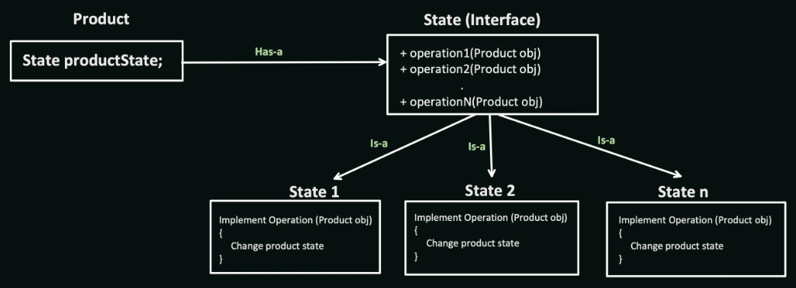

# State Design Pattern

The State design pattern allows an object to alter its behavior when its internal state changes. It achieves this by encapsulating different states as objects and associating the object's behavior with its current state. This pattern is useful in scenarios where:

* An object's behavior changes based on its state: When the behavior of an object depends on its internal state (e.g., an order being placed, shipped, or cancelled).
* State transitions are common: When an object frequently transitions between different states with distinct behaviors.
* Improved code readability and maintainability: Encapsulating state behavior improves code clarity and simplifies modifications.

## Benefits

* Dynamic Behavior: Allows objects to dynamically change their behavior based on their internal state.
* Improved Maintainability: Makes state transitions and behavior logic more manageable.
* Decoupling: Decouples object behavior from its context, enhancing flexibility.

## Implementation

The State design pattern involves the following key components:

1. Context: The object whose behavior changes based on its state.
2. State Interface: Defines the methods for handling state-specific behavior (e.g., doAction()).
3. Concrete States: Implement the State Interface and represent specific object states (e.g., OrderPlacedState, OrderShippedState).



## Example

Consider an Order object that can transition between different states, such as "Placed" and "Shipped." We can use the State pattern to encapsulate the behavior for each state and allow the Order object to change its behavior based on its current state.

```java
public interface OrderState {
void doAction(Order order);
}

public class Order {
private OrderState state;

public Order(OrderState state) {
this.state = state;
}

public void setState(OrderState state) {
this.state = state;
}

public void doSomething() {
state.doAction(this);
}
}

public class OrderPlacedState implements OrderState {
@Override
public void doAction(Order order) {
System.out.println("Order placed, processing payment...");
// Order logic for placed state
order.setState(new OrderShippedState());
}
}

public class OrderShippedState implements OrderState {
@Override
public void doAction(Order order) {
System.out.println("Order shipped, notify customer...");
// Order logic for shipped state
}
}

public class Main {
public static void main(String[] args) {
Order order = new Order(new OrderPlacedState());
order.doSomething(); // Output: Order placed, processing payment...

    order.doSomething(); // Output: Order shipped, notify customer... (different behavior)
}
}
```

```python
from abc import ABC, abstractmethod

class OrderState(ABC):
@abstractmethod
def do_action(self, order):
pass

class Order:
def __init__(self, state):
self.state = state

def set_state(self, state):
self.state = state

def do_something(self):
self.state.do_action(self)

class OrderPlacedState(OrderState):
def do_action(self, order):
print("Order placed, processing payment...")
# Order logic for placed state
order.set_state(OrderShippedState())

class OrderShippedState(OrderState):
def do_action(self, order):
print("Order shipped, notify customer...")
# Order logic for shipped state

# Usage
order = Order(OrderPlacedState())
order.do_something()  # Output: Order placed, processing payment...

order.do_something()  # Output: Order shipped, notify customer... (different behavior)
```
    

## Key points:

* The State pattern promotes modularity by encapsulating behavior within specific state objects.
* This pattern allows for adding new states and their behaviors without affecting the core object logic.
* It improves code readability by making the relationship between state and behavior more explicit.