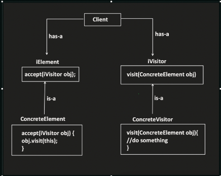

# Visitor Design Pattern

The Visitor design pattern allows you to define new operations without modifying the classes of the elements they operate on, and encourage Open/Close Principle. It achieves this by introducing a separate Visitor object that visits each element in a collection and performs an operation specific to that element's type.

## When to Use:

* When you need to add new operations to a collection of objects without modifying their existing classes.
* When you want to avoid creating a conditional statement in the client code for each new operation.
* When you want to decouple the concrete element classes from the specific operations performed on them.


## Benefits:

* Open/Closed Principle (OCP): New operations can be added without modifying existing classes.
* Decoupling: Separates the visitor from the element classes, improving maintainability.
* Flexibility: Enables implementation of various operations on the elements.
* Double Dispatch (Optional): Allows for more complex operations based on both visitor and element types.

## Implementation:

1. Element Interface: Defines an interface that all element classes in the collection implement. This interface typically includes an accept() method that takes a visitor object as an argument.
2. Concrete Elements: Implement the Element interface and represent the different types of objects in the collection.
3. Visitor Interface: Defines the operations that can be performed on the elements. Each operation takes an Element object as an argument.
4. Concrete Visitors: Implement the Visitor interface and provide specific implementations for the operations defined on different types of elements. (Optional: Use double dispatch for more complex interactions.)




## Example:

```Java
public interface Element {
  void accept(Visitor visitor);
}

public class Shape implements Element {
  private String name;

  public Shape(String name) {
    this.name = name;
  }

  @Override
  public void accept(Visitor visitor) {
    visitor.visit(this);
  }

  public String getName() {
    return name;
  }
}

public class Circle extends Shape {
  public Circle(String name) {
    super(name);
  }
}

public class Square extends Shape {
  public Square(String name) {
    super(name);
  }
}

public interface Visitor {
  void visit(Circle circle);
  void visit(Square square);
}

public class AreaVisitor implements Visitor {
  @Override
  public void visit(Circle circle) {
    System.out.println("Calculating area of circle: " + circle.getName());
  }

  @Override
  public void visit(Square square) {
    System.out.println("Calculating area of square: " + square.getName());
  }
}

public class Main {
  public static void main(String[] args) {
    List<Shape> shapes = Arrays.asList(new Circle("Circle1"), new Square("Square1"));

    AreaVisitor visitor = new AreaVisitor();
    for (Shape shape : shapes) {
      shape.accept(visitor);
    }
  }
}
```

```Python
from abc import ABC, abstractmethod

class Element(ABC):
  @abstractmethod
  def accept(self, visitor):
    pass

class Shape(Element):
  def __init__(self, name):
    self.name = name

  def accept(self, visitor):
    visitor.visit(self)

  def get_name(self):
    return self.name

class Circle(Shape):
  pass

class Square(Shape):
  pass

class Visitor(ABC):
  @abstractmethod
  def visit(self, shape):
    pass

class AreaVisitor(Visitor):
  def visit(self, shape):
    if isinstance(shape, Circle):
      print(f"Calculating area of circle: {shape.get_name()}")
    elif isinstance(shape, Square):
      print(f"Calculating area of square: {shape.get_name()}")
    else:
      raise TypeError("Unsupported shape type")

# Usage
shapes = [Circle("Circle1"), Square("Square1")]

visitor = AreaVisitor()
for shape in shapes:
  shape.accept(visitor)
```

## Key Points:

* The Visitor pattern enables the addition of new operations without modifying existing classes.
* It promotes loose coupling between the visitor and element classes, improving maintainability.
* The option for double dispatch using instanceof checks allows for more dynamic visitor-element interactions.

