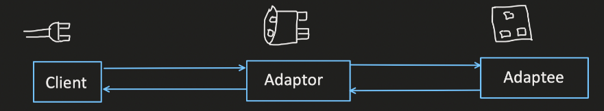
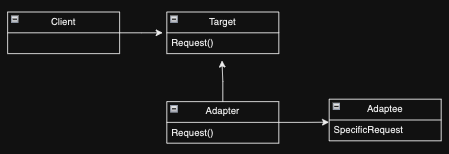
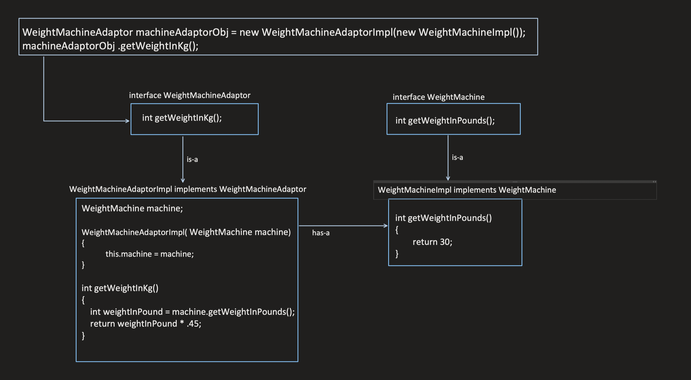

# Adapter Design Pattern

The Adapter design pattern allows you to make an incompatible interface of an object (Adaptee) compatible with the interface expected by a client. It achieves this by introducing an intermediary object (Adapter) that wraps the Adaptee and translates its methods to match the client's expectations.

## When to Use:

* When you need to use an existing class (Adaptee) with an incompatible interface.
* When you want to avoid modifying the existing class (Adaptee).
* When you want to create reusable classes that can work with different interfaces.

Any type of conversion between two incompatible interfaces can be done using Adapter Design Pattern i.e. XML to JSON, int to binary, Pound to KG  etc..  or vice versa.

## Benefits:

* Compatibility: Enables using incompatible objects by adapting their interfaces.
* Reusability: Promotes reusability of existing classes by wrapping them with adapters.
* Flexibility: Provides flexibility by allowing different adapters for different interface needs.
* Loose Coupling: Decouples clients from the specific implementation of the Adaptee, promoting loose coupling.

## Implementation:

1. Target Interface: Defines the interface that the client expects.
2. Adaptee: Represents the existing class with an incompatible interface.
3. Adapter: Implements the Target Interface and wraps the Adaptee. It translates calls to the Target Interface methods into calls to the compatible methods of the Adaptee.







## Example:
```java
public interface MediaPlayer {
  void play(String audioType);
}

public class VlcPlayer implements MediaPlayer {
  @Override
  public void play(String audioType) {
    if (audioType.equalsIgnoreCase("vlc")) {
      System.out.println("Playing VLC audio");
    } else {
      System.out.println("Invalid audio format");
    }
  }
}

public class Mp3Player {
  public void playMp3(String fileName) {
    System.out.println("Playing MP3: " + fileName);
  }
}

public class MediaAdapter implements MediaPlayer {
  private Mp3Player mp3Player;

  public MediaAdapter(Mp3Player mp3Player) {
    this.mp3Player = mp3Player;
  }

  @Override
  public void play(String audioType) {
    if (audioType.equalsIgnoreCase("mp3")) {
      mp3Player.playMp3(audioType);
    } else {
      System.out.println("Invalid audio format");
    }
  }
}

public class Main {
  public static void main(String[] args) {
    MediaPlayer audioPlayer1 = new VlcPlayer();
    audioPlayer1.play("vlc"); // Output: Playing VLC audio

    MediaPlayer audioPlayer2 = new MediaAdapter(new Mp3Player());
    audioPlayer2.play("mp3"); // Output: Playing MP3: mp3
  }
}
```

```python
from abc import ABC, abstractmethod

class MediaPlayer(ABC):
  @abstractmethod
  def play(self, audio_type):
    pass

class VlcPlayer(MediaPlayer):
  def play(self, audio_type):
    if audio_type == "vlc":
      print("Playing VLC audio")
    else:
      print("Invalid audio format")

class Mp3Player:
  def play_mp3(self, file_name):
    print(f"Playing MP3: {file_name}")

class MediaAdapter(MediaPlayer):
  def __init__(self, mp3_player):
    self.mp3_player = mp3_player

  def play(self, audio_type):
    if audio_type == "mp3":
      self.mp3_player.play_mp3(audio_type)
    else:
      print("Invalid audio format")

# Usage
audio_player1 = VlcPlayer()
audio_player1.play("vlc")  # Output: Playing VLC audio

audio_player2 = MediaAdapter(Mp3Player())
audio_player2.play("mp3")  # Output: Playing MP3: mp3
```

* Key Points:

* The Adapter pattern allows using incompatible objects by introducing an adapter that translates interfaces.
* It promotes reusability of existing classes and flexibility by providing different adapters for different needs.
* Adapters can be implemented in various ways, such as class adapters or object adapters.