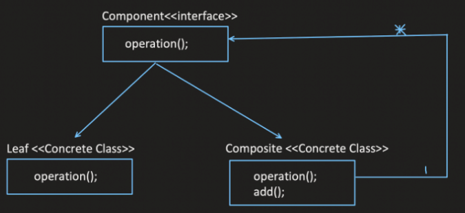
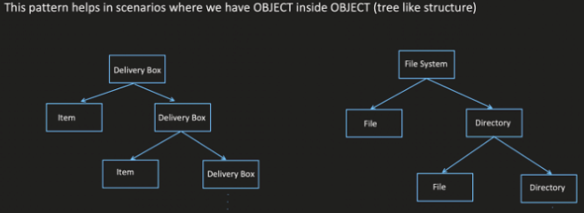

# Composite Design Pattern

The Composite design pattern allows you to treat a group of objects as a single object. This creates a tree structure where composite objects can contain other objects (leaf objects or composite objects), enabling you to work with them uniformly.

## When to Use:

* When you need to represent part-whole hierarchies of objects.
* When you want to treat individual objects and groups of objects in a similar way.
* When you want to simplify the manipulation of hierarchical structures.
  
Any problem which can be designed as a Tree falls in this DP

## Benefits:

* Hierarchical Organization: Enables representing complex hierarchical structures efficiently.
* Uniform Interface: Provides a uniform interface for both individual objects and groups of objects.
* Flexibility: Simplifies operations performed on individual objects and entire hierarchies.
* Reusability: Code written to work on composite objects can be reused for both individual objects and compositions.

## Implementation:

1. Component Interface: Defines the interface for both individual objects (leaves) and composite objects. This interface specifies the methods that clients can call to interact with objects in the hierarchy.
2. Leaf Object: Implements the Component interface and represents the basic unit in the hierarchy, usually without containing other objects.
3. Composite Object: Implements the Component interface and can contain other Component objects. It defines methods for adding/removing child components and provides implementations for methods in the Component interface that delegate to its children.





## Example:
```java
public interface Shape {
  void draw();
}

public class Circle implements Shape {
  @Override
  public void draw() {
    System.out.println("Drawing a circle");
  }
}

public class Triangle implements Shape {
  @Override
  public void draw() {
    System.out.println("Drawing a triangle");
  }
}

public class Drawing implements Shape {
  private List<Shape> shapes;

  public Drawing() {
    shapes = new ArrayList<>();
  }

  public void add(Shape shape) {
    shapes.add(shape);
  }

  public void remove(Shape shape) {
    shapes.remove(shape);
  }

  @Override
  public void draw() {
    for (Shape shape : shapes) {
      shape.draw();
    }
  }
}

public class Main {
  public static void main(String[] args) {
    Shape circle = new Circle();
    Shape triangle = new Triangle();

    Drawing drawing = new Drawing();
    drawing.add(circle);
    drawing.add(triangle);

    drawing.draw(); // Output: Drawing a circle  Drawing a triangle
  }
}
```

```python
from abc import ABC, abstractmethod

class Shape(ABC):
  @abstractmethod
  def draw(self):
    pass

class Circle(Shape):
  def draw(self):
    print("Drawing a circle")

class Triangle(Shape):
  def draw(self):
    print("Drawing a triangle")

class Drawing(Shape):
  def __init__(self):
    self.shapes = []

  def add(self, shape):
    self.shapes.append(shape)

  def remove(self, shape):
    self.shapes.remove(shape)

  def draw(self):
    for shape in self.shapes:
      shape.draw()

# Usage
circle = Circle()
triangle = Triangle()

drawing = Drawing()
drawing.add(circle)
drawing.add(triangle)

drawing.draw()  # Output: Drawing a circle  Drawing a triangle
```

## Key Points:

* The Composite pattern allows for creating hierarchical structures of objects with a uniform interface.
* It simplifies working with both individual objects and entire hierarchies.
* Composite objects delegate operations to their children, promoting recursive behavior.