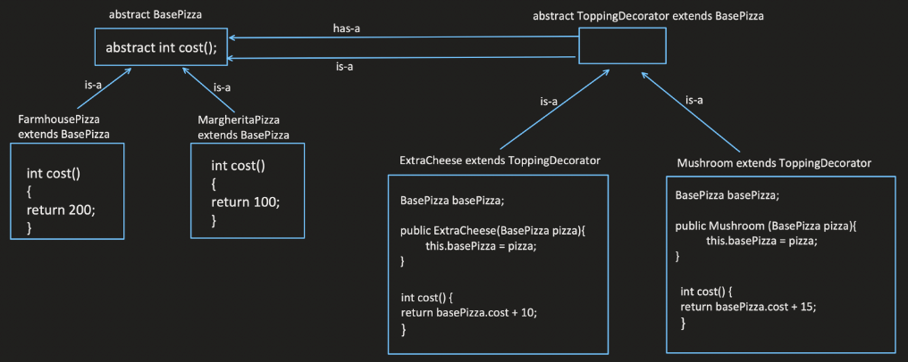

# Decorator Design Pattern

The Decorator design pattern allows you to add new functionalities to an object dynamically without modifying its existing class. It achieves this by wrapping the object in a decorator object that adds its own behavior. Decorators can be chained together to create complex combinations of functionalities.

## When to Use:

* When you need to add new functionalities to objects without modifying their existing classes.
* When you want to avoid subclassing for every possible combination of functionalities.
* When you want to dynamically change an object's behavior at runtime.

## Benefits:

* Open/Closed Principle (OCP): New functionalities can be added without modifying existing classes.
* Flexibility: Enables building complex functionalities by combining decorators.
* Maintainability: Keeps core object logic clean and avoids extensive subclassing.
* Decoupling: Separates decorator logic from the core object, promoting loose coupling.

## Implementation:

1. Component Interface: Defines the interface for the objects that can be decorated. This interface specifies the methods that decorators can call on the component.
2. Concrete Component: Implements the Component interface and represents the core object whose functionality can be extended.
3. Decorator: Implements the Component interface and provides additional functionalities. It holds a reference to a Component object (often through composition) and delegates some or all calls to the wrapped object, adding its own behavior before or after the delegation.




## Example:

```Java
public interface Shape {
  void draw();
}

public class Circle implements Shape {
  @Override
  public void draw() {
    System.out.println("Drawing a circle");
  }
}

public abstract class Decorator implements Shape {
  private Shape decoratedShape;

  public Decorator(Shape decoratedShape) {
    this.decoratedShape = decoratedShape;
  }

  @Override
  public void draw() {
    decoratedShape.draw();
  }
}

public class ColoredDecorator extends Decorator {
  private final String color;

  public ColoredDecorator(Shape decoratedShape, String color) {
    super(decoratedShape);
    this.color = color;
  }

  @Override
  public void draw() {
    super.draw();
    System.out.println("  colored " + color);
  }
}

public class BorderDecorator extends Decorator {
  public BorderDecorator(Shape decoratedShape) {
    super(decoratedShape);
  }

  @Override
  public void draw() {
    super.draw();
    System.out.println("  with border");
  }
}

public class Main {
  public static void main(String[] args) {
    Shape circle = new Circle();

    Shape redCircle = new ColoredDecorator(circle, "red");
    redCircle.draw(); // Output: Drawing a circle  colored red

    Shape redCircleWithBorder = new BorderDecorator(redCircle);
    redCircleWithBorder.draw(); // Output: Drawing a circle  colored red  with border
  }
}
```

```python
from abc import ABC, abstractmethod

class Shape(ABC):
  @abstractmethod
  def draw(self):
    pass

class Circle(Shape):
  def draw(self):
    print("Drawing a circle")

class Decorator(Shape):
  def __init__(self, decorated_shape):
    self.decorated_shape = decorated_shape

  def draw(self):
    self.decorated_shape.draw()

class ColoredDecorator(Decorator):
  def __init__(self, decorated_shape, color):
    super().__init__(decorated_shape)
    self.color = color

  def draw(self):
    super().draw()
    print(f"  colored {self.color}")

class BorderDecorator(Decorator):
  def draw(self):
    super().draw()
    print("  with border")

# Usage
circle = Circle()

red_circle = ColoredDecorator(circle, "red")
red_circle.draw()  # Output: Drawing a circle  colored red

red_circle_with_border = BorderDecorator(red_circle)
red_circle_with_border.draw()  # Output: Drawing a circle  colored red  with border
```

## Key Points:

* The Decorator pattern allows adding functionalities dynamically through decorator objects.
* It promotes the Open/Closed Principle and improves code maintainability by avoiding subclassing for every possible combination.
* Decorators can be chained to create complex combinations of functionalities.