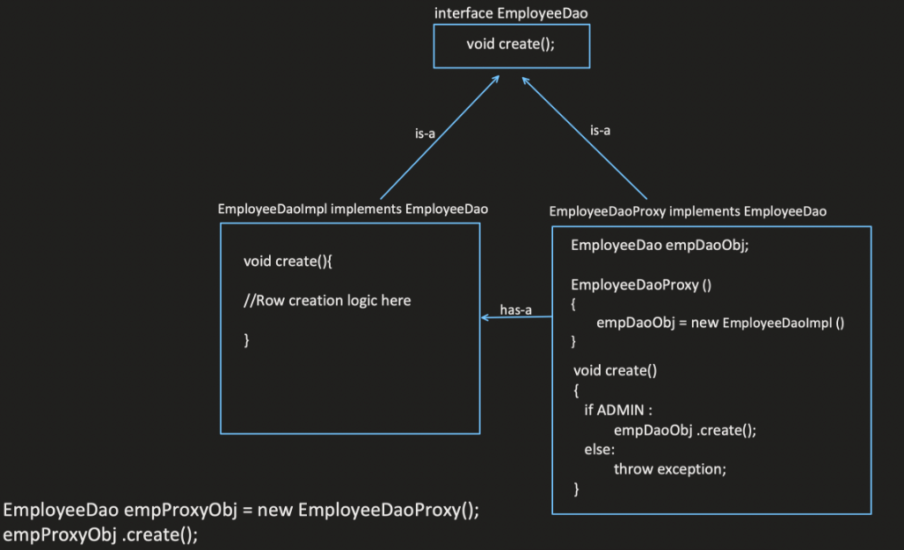

# Proxy Design Pattern

The Proxy design pattern introduces an intermediary object (Proxy) that acts as a surrogate for another object (Real Subject). The Proxy controls access to the Real Subject and can provide additional functionalities such as security checks, lazy loading, or caching before or after delegating operations to the Real Subject.

## When to Use:

* When you need to control access to an object (e.g., security checks).
* When you want to defer the creation of an expensive object (lazy loading).
* When you want to add additional functionalities before or after delegating operations to the Real Subject (e.g., caching).
* When you want to simplify the interface of a complex object by providing a simpler Proxy interface.

## Benefits:

* Access Control: Allows implementing security checks or restrictions before accessing the Real Subject.
* Lazy Loading: Delays the creation of the Real Subject until it's actually needed, improving efficiency.
* Caching: Caches results returned by the Real Subject to optimize performance.
* Decoupling: Reduces coupling between client code and the Real Subject, making it easier to modify or replace the Real Subject.
* Simplified Interface: Can provide a simpler interface for complex Real Subjects.

## Implementation:

1. Subject Interface: Defines the interface for both the Proxy and Real Subject objects. This interface specifies the methods that clients can call to interact with the object.
2. Real Subject: Implements the Subject interface and represents the actual object whose functionality is being proxied.
3. Proxy: Implements the Subject interface and acts as an intermediary between the client and the Real Subject. It controls access to the Real Subject and may perform additional functionalities before or after delegating operations.

Use Case: Access restriction,  caching (proxy will check data in cache), pre and post processing , Spring boot create proxy of each bean.

we can create proxy of proxy also




## Example:
    
```java
public interface File {
  void read();
  void write(String content);
}

public class RealFile implements File {
  private String filename;

  public RealFile(String filename) {
    this.filename = filename;
  }

  @Override
  public void read() {
    System.out.println("Reading contents of file: " + filename);
  }

  @Override
  public void write(String content) {
    System.out.println("Writing content to file: " + filename);
  }
}

public class SecurityProxy implements File {
  private File realFile;
  private String password;

  public SecurityProxy(String filename, String password) {
    this.realFile = new RealFile(filename);
    this.password = password;
  }

  @Override
  public void read() {
    if (authenticate(password)) {
      realFile.read();
    } else {
      System.out.println("Access denied for reading file");
    }
  }

  @Override
  public void write(String content) {
    if (authenticate(password)) {
      realFile.write(content);
    } else {
      System.out.println("Access denied for writing to file");
    }
  }

  private boolean authenticate(String password) {
    return password.equals(this.password); // Replace with actual authentication logic
  }
}

public class Main {
  public static void main(String[] args) {
    File file = new SecurityProxy("myfile.txt", "secret");

    file.read();   // Output: Access denied for reading file (if incorrect password)
    file.read();   // Output: Reading contents of file: myfile.txt (if correct password)
    file.write("New content"); // Output: Access denied for writing to file (if incorrect password)
  }
}
```

```python
from abc import ABC, abstractmethod

class File(ABC):
  @abstractmethod
  def read(self):
    pass

  @abstractmethod
  def write(self, content):
    pass

class RealFile(File):
  def __init__(self, filename):
    self.filename = filename

  def read(self):
    print(f"Reading contents of file: {self.filename}")

  def write(self, content):
    print(f"Writing content to file: {self.filename}")

class SecurityProxy(File):
  def __init__(self, filename, password):
    self.real_file = RealFile(filename)
    self.password = password

  def read(self):
    if self.authenticate(self.password):
      self.real_file.read()
    else:
      print("Access denied for reading file")

  def write(self, content):
    if self.authenticate(self.password):
      self.real_file.write(content)
    else:
      print("Access denied for writing to file")
```